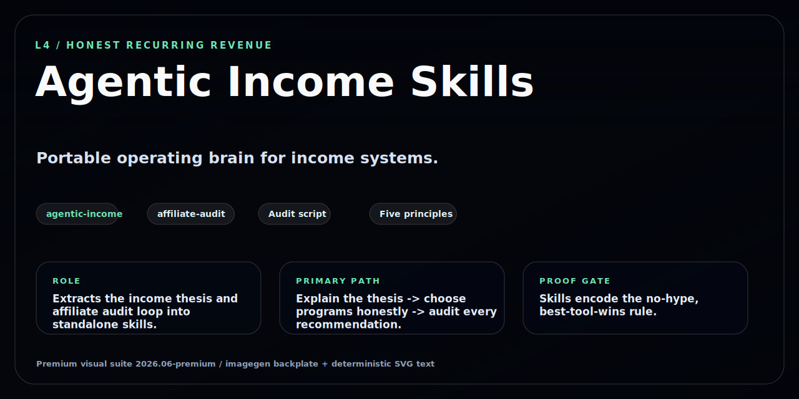
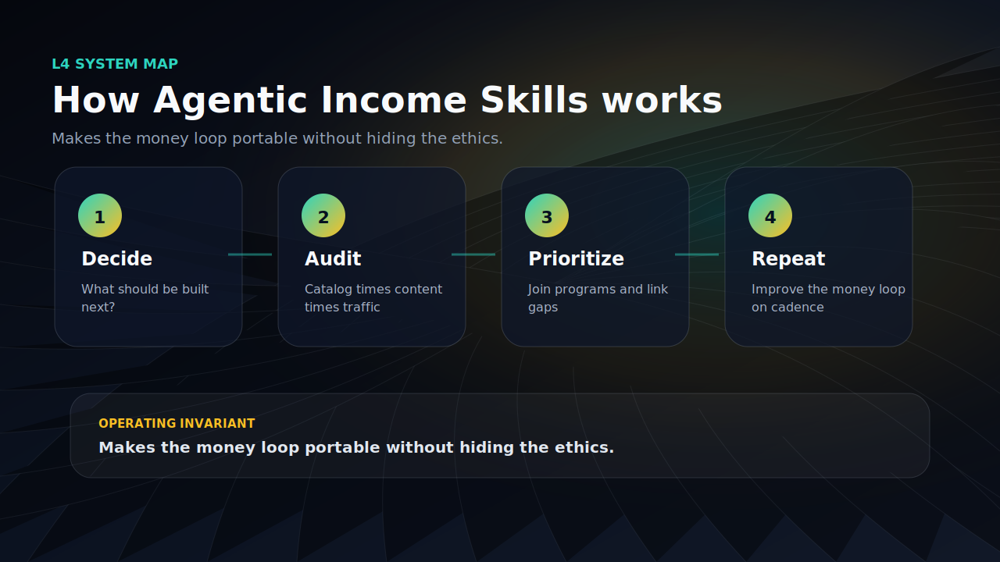

<!-- GITHUB_VISUALS_START -->
<p align="center">
  
</p>

<details open>
<summary><strong>How this repo works</strong></summary>
<p align="center">
  
</p>
</details>

<!-- GITHUB_VISUALS_END -->

# Agentic Income Skills

Two portable agent skills that give any AI coding agent (Claude Code, Cursor, etc.) the brain to build and run honest AI-tool income systems. Drop them into your agent and ask "what should I build next?"

**MIT.** These are the operating skills extracted from the [`affiliate-agent-skills`](https://github.com/frankxai/affiliate-agent-skills) engine — install them standalone, or use the full engine for the catalog + audit pipeline + business plan.

## The skills

| Skill | What it does |
|---|---|
| **`agentic-income`** | The operating brain — the thesis (frontier tools rank, adjacents pay), five principles, the "what to build next" decision logic, and the four self-improving loops. Use it to plan, build, or scale an income network. |
| **`affiliate-audit`** | The money loop — joins a program catalog × your content × traffic to surface (a) which programs to join next and (b) which existing posts mention a payer with no link. Includes `scripts/affiliate-audit.mjs`. |

## Install

**Claude Code** — copy the skills into your skills directory:

```bash
git clone https://github.com/frankxai/agentic-income-skills
cp -r agentic-income-skills/skills/* ~/.claude/skills/
```

Then invoke `agentic-income` when planning an income system, or `affiliate-audit` to find monetization gaps. They work in any repo.

**Any agent** — point your agent at `skills/agentic-income/SKILL.md` as a system/context file. It's plain Markdown with YAML frontmatter; no runtime required.

## Run the audit

```bash
node scripts/affiliate-audit.mjs --content=<your-site>/content --write
```

Reads `data/programs.json` (the starter catalog) × your content → ranks programs to join and posts to link, writes `AUDIT.md`.

## The five principles (the whole philosophy)

1. **Honest pick always wins** — never let a commission override the truth.
2. **Recurring > one-time** — passive income compounds on subscriptions.
3. **Own the audience** — capture the email; it's the asset no algorithm can take.
4. **Build the engine once, fork the sites** — effort goes into the substrate.
5. **Compounding over spikes** — optimize for what still earns in 12 months.

## See also

- [affiliate-agent-skills](https://github.com/frankxai/affiliate-agent-skills) — the full engine (catalog + audit + business plan).
- [agentic-income-template](https://github.com/frankxai/agentic-income-template) — clone-and-deploy site that consumes these skills.
- [awesome-agentic-income](https://github.com/frankxai/awesome-agentic-income) — the curated resource list.
