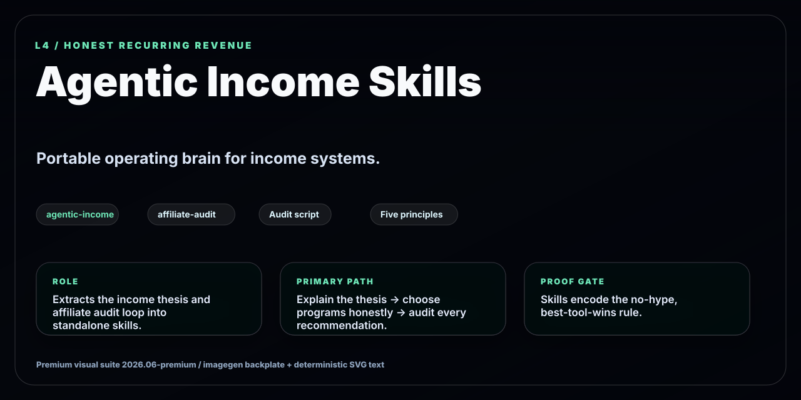
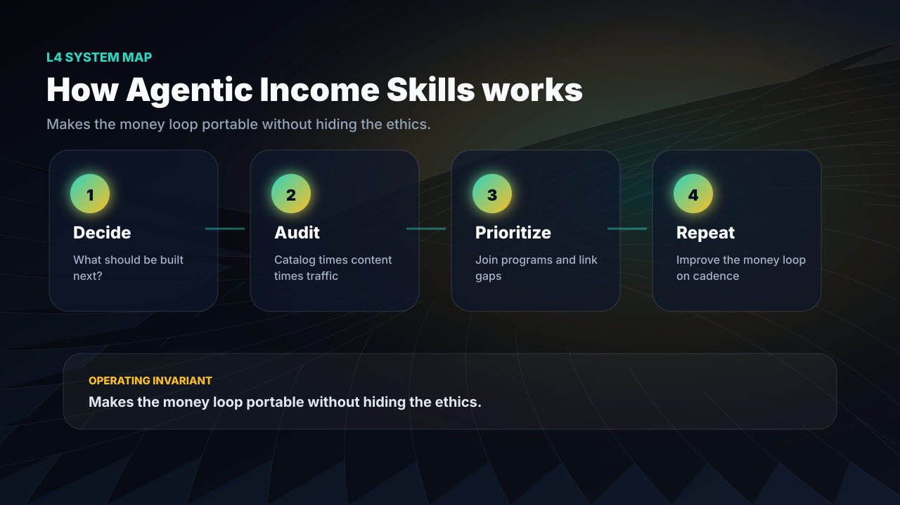
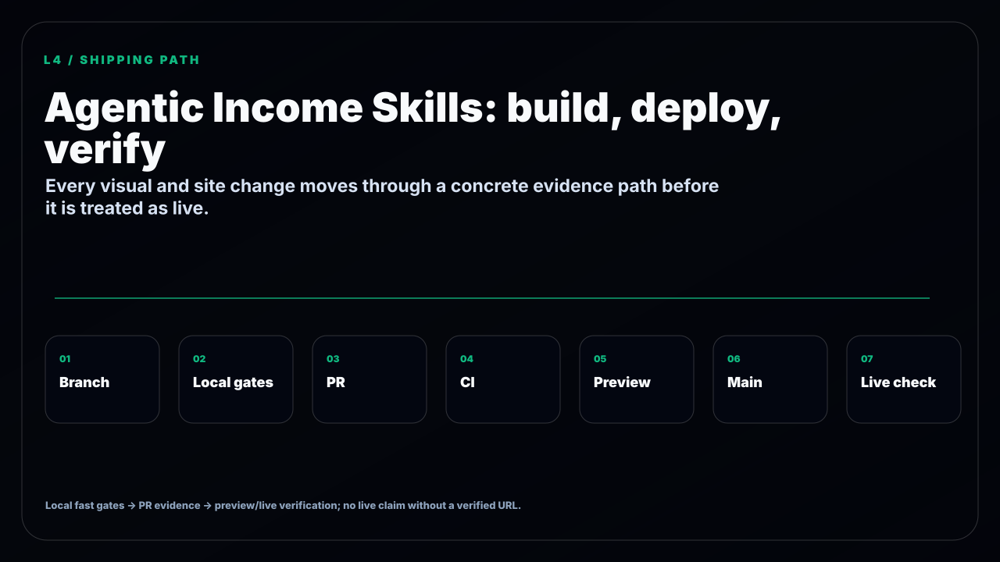

<!-- GITHUB_VISUALS_START -->

  

<strong>How this repo works</strong>

  

<strong>Build, deploy, verify path</strong>

  

<!-- GITHUB_VISUALS_END -->

# Agentic Income Skills

Open contracts, portable skills, and reference systems for principal-owned agents that perform paid work.

Agentic Income does not pretend an agent is a company, bank-account holder, or unrestricted wallet owner. A human or legal entity owns the service, accounts, credentials, obligations, and money. Agents operate inside declared capabilities, budgets, approvals, evals, and revocation.

The product unit is an Outcome Pack:

- buyer, problem, outcome, and acceptance criteria;
- offer and legal principal;
- agent skills, workflow, interfaces, and customer-owned connectors;
- authority, approval, budget, and revocation policy;
- eval suite, operations, economics, and evidence.

MIT licensed. No account, hosted runtime, customer data, paid payload, or private credential is required.

## What ships

| Surface | Purpose |
| --- | --- |
| skills/agentic-income | Discover, validate, build, sell, deliver, operate, publish, prove, and improve an income system |
| schemas/income-system.v1.schema.json | Open system, authority, evaluation, economics, and proof contract |
| scripts/validate-income-system.mjs | JSON Schema plus non-negotiable policy validation |
| scripts/scaffold-income-system.mjs | Creates an owned copy of the reference Outcome Pack |
| examples/request-to-quote-desk | First governed vertical system |
| skills/affiliate-audit | Legacy-compatible adjunct for honest affiliate opportunity audits |

Affiliate and income-asset automation belongs to the Agentic Passive Income discipline. It remains here temporarily for compatibility while the public passive-income core is consolidated.

## Quick start

Install dependencies and validate the reference system:

    npm install
    npm test
    npm run income:validate -- examples/request-to-quote-desk/income-system.json

Create an owned working copy:

    npm run income:init -- --output=../my-quote-desk

Then ask an agent:

    /agentic-income build a request-to-quote desk for Amsterdam renovation
    businesses, with human approval before pricing or outbound commitments.

## Discipline boundary

Agentic Income covers accepted paid work:

- productized agent services;
- websites and AI systems for local or vertical businesses;
- data, evaluation, and research services sold to people or agents;
- governed remote capabilities exposed through Skills, MCP, or A2A.

Agentic Passive Income covers owned assets that continue selling with bounded maintenance: affiliate systems, products, reports, skills, software, datasets, licensing, and recurring knowledge.

DPI covers simulation-first protocol, crypto, capital, yield, and frontier mechanisms.

All three may share one private economic graph. They do not share unrestricted financial authority.

## Trust rules

1. The service always names the legal principal.
2. The customer owns production accounts, credentials, domains, and data.
3. Default authority is deny.
4. Prices, contracts, transfers, permission increases, and public income claims are human-gated.
5. Secrets never enter the manifest, Git, or model context.
6. Every claimed outcome is tied to acceptance criteria, eval version, system hash, economic events, and evidence.
7. No guaranteed income, hidden affiliate routing, pooled funds, custody, or autonomous investment execution.

## Related repositories

- Agentic Income platform: https://github.com/frankxai/agenticincome
- Agentic Passive Income app: https://github.com/frankxai/agenticpassiveincome
- Public passive-income engine: https://github.com/frankxai/affiliate-agent-skills
- DPI substrate: https://github.com/frankxai/dpi
- Curated ecosystem list: https://github.com/frankxai/awesome-agentic-income

See docs/income-system-v1.md for the contract and examples/request-to-quote-desk for the reference Outcome Pack.
